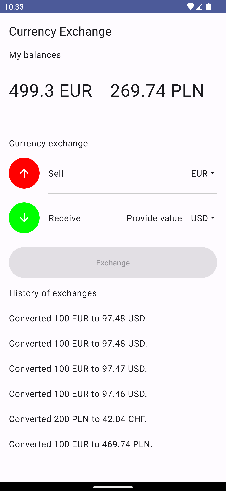
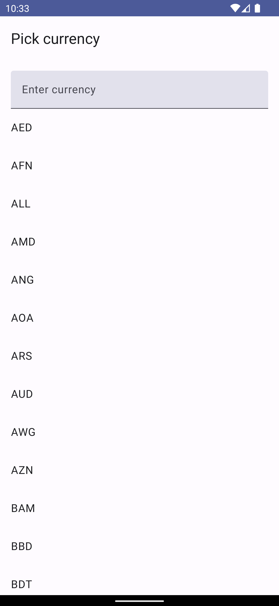
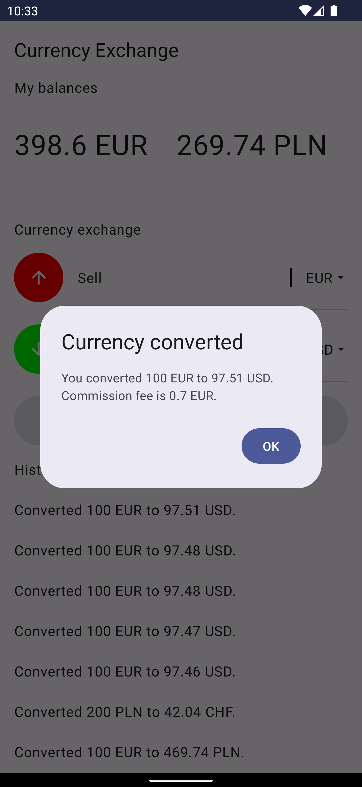

## Readme of Currency Exchange Project

### Information about the project

This project is a sample project to verify skills.

## Assigment
Task assigment is available  [here](https://gist.github.com/edgar-zigis/8de2854ee0d36d032734fdd60d56eb69)
## How to launch
To build the app you need to create an `api.properties` file in the project's root, and put the `apiKey` variable with your apiKey.

## Android Stack
- **Kotlin** - primary language
- **Coroutines** - concurrency
- **StateFlow** - keeping app state
- **SharedFlow** - emit one single event
- **Jetpack Compose** - build UI
- **Material3** - style app
- **ViewModel** - container for everything
- **Room** - database
- **Dagger Hilt** - dependency injection
- **Gson** - parsing JSON
- **Retrofit** - making a REST request
- **OkHTTP** - manage headers

## App Structure
- **di** - package where are located all Dagger Hilt classes.
- **domain** - package which contains all domain classes - which should be independent from framework and represent app logic.
- **local** - package which contains all implementation of local storage in application. In this case is used Room and Shared Preferences.
- **network** - the same like a local but contains classes for network communication.
- **ui** - Implementation of Material3.
- **view** - package which contains all element which user see and interact.

## Architecture of View
- 

## What can be improved
- **Multi module application** - app should be divide for different modules which should be separate
- **Error handling and parsing** - this logic should be delegated to some kind of special error parser.
- **More unit test** - I didn't have enough time to test all classes, especially ViewModel
- **Inconsistency in variables** - sometimes I use `BigDecimal`, sometimes I use `double`.
- **Using Currency object from Java API** - I know that it exist - I could replace of my own Currency class by this from Java API.
  | Column of screenshots 1  | Column of screenshots 2  | Column of screenshots 3  |
  |:----------|:----------|:----------|
  ||||
